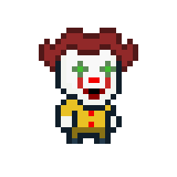

## Overview
Make Me Laugh is a short 2D collection-style game that was built by my partner and I in 2 days for Global Game Jam 2024.

In this game, you play as a clown with no teeth as you attempt to collect them all from a creepy abandoned circus. 

 

### Code

Check out the github [repository.](https://github.com/StacyG15/MakeMeLaugh)

If you're interested in seeing the code click *assets* >> *scripts* 

### Demo


---

## How to Play
Play on [itch.io](https://stacyg15.itch.io/make-me-laugh) in **fullscreen** (*click expanding arrows in bottom right of window*).

### Controls
- Use WASD to move

- Click with left mouse button to interact with UI and continue dialogue

---

## Tech Stack
- Unity
- C#
- Github (*collaboration and version control*)
- TextMeshPro (*Unity plugin*)
